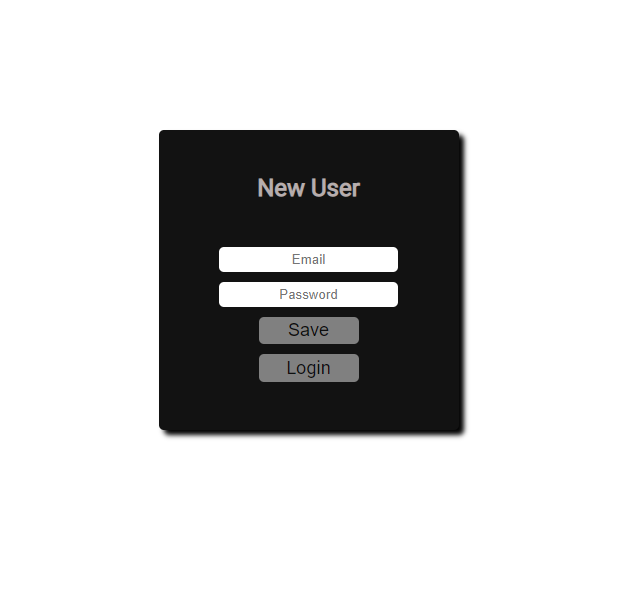
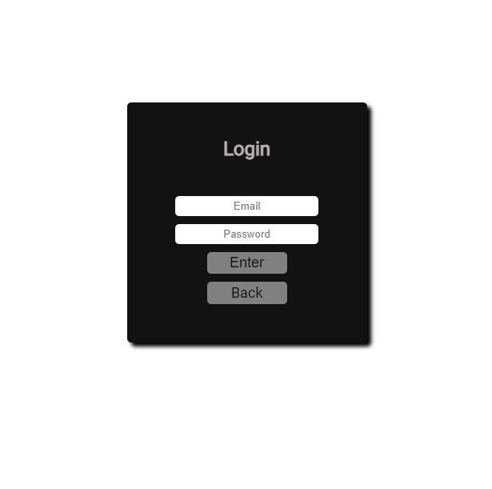
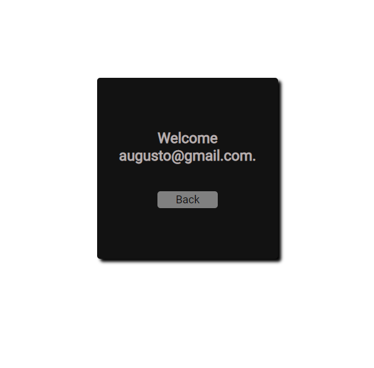

# About
I made this site like a tutorial to teach the beginners in front-end , to make their fist project , this app is a login form saving the data on local storage.💻
The tutorial video is on my youtube channel [here](https://www.youtube.com/watch?v=_6vsEZIoKD4&t=4591s)

To check the real result just click [here](https://tutorial-login.netlify.app)

 

# Data

This app save the user Email and password , get all the values and save on local storage, after the login page validate if the data is equal.

Validation:

Validate if the inputs are empty.
Validate if the email is valid like ( augusto@gmail.com ).
Validate if the password lenght have more then 6 letters

# Design 🖥️

